# System Architecture

## Overview
The Travel Planning Assistant is built using an **LLM-based agent system** that dynamically determines which APIs to call based on user queries.

## Architecture Components
1. **User Query Processing**: The system processes natural language inputs.
2. **Tool Selection**: The LLM decides which tools (APIs) to invoke.
3. **API Execution**: The selected APIs are queried for relevant data.
4. **Response Generation**: The processed results are returned in a user-friendly format.

## Flow Diagram

```mermaid
graph TD;
    User["🧑 User"] -->|Asks Query| LLM["🤖 LLM (qwen2.5:7b)"];
    LLM -->|Determines Required Tool| Tools["🛠️ Tool Selector"];
    Tools -->|Invokes Relevant APIs| APIs["🌐 External APIs"];
    APIs -->|Fetches Data| API_Responses["📦 API Responses"];
    API_Responses -->|Processes and Formats Data| LLM;
    LLM -->|Returns Final Answer| User;
```
